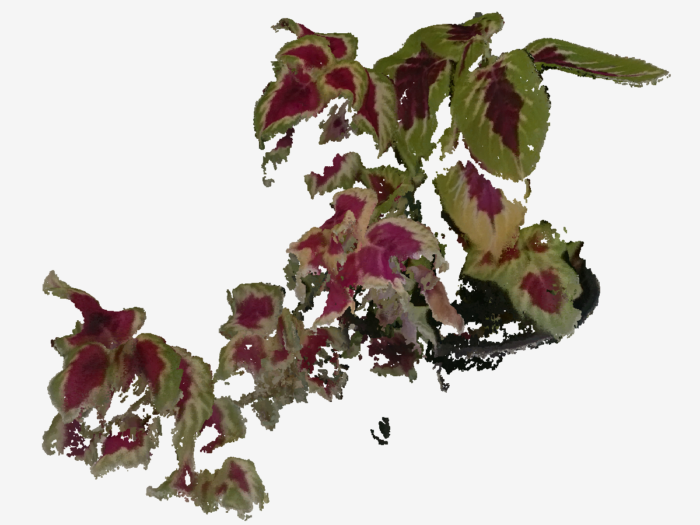

# Coleus reconstruction recovery — 20260901122109

## Result and acceptance boundary

The new candidate contains **1,143,251 points** from **20 fused reference views**. It recovers curved leaves and branch connections substantially more clearly than the previous tracked sensor-depth result. This is RGB multi-view stereo followed by actual coloured ICP and 3D surface fusion. It is not simply the old sensor-depth ICP with a different threshold.

It is **not a perfect, closed, fully observed 360-degree plant**, and it has not been validated for physical trait accuracy. Some gaps and incomplete surfaces remain when rotated. Those may reflect occlusion, difficult image texture, or conservative filtering; they have not all been individually attributed to a capture limitation. The exported model includes the visible pot.

[Open the interactive comparison](index.html) · [Download upright PLY](plant_upright.ply) · [Download camera-coordinate PLY](plant_rgb_icp.ply)

## Why the older plant worked better

The camera observed very different depth ranges. Using the same assumed 10,000 raw depth units per metre, the following are 5th, median, and 95th percentiles from automatic coloured-leaf pixel selections. They are diagnostics, not manual ground truth.

| Source frame | 5th percentile | Median | 95th percentile |
| --- | ---: | ---: | ---: |
| test_plant_20230809133659 / depth_505785.png | 13.29 cm | 16.88 cm | 24.88 cm |
| 20260901122109 / depth/750.png | 42.06 cm | 45.32 cm | 66.43 cm |

The new frame has 31.9% of its selected coloured-leaf pixels beyond 50 cm. RealSense specifies the D405's ideal range as **7–50 cm**. This difference is consistent with the much poorer depth around the lower foliage, but does not prove that every error comes from camera range. [RealSense D405 specifications](https://www.realsenseai.com/products/stereo-depth-camera-d405/).

The stretched surfaces are already present in individual sensor-depth frames. Accumulating them with ICP or TSDF preserves or thickens the error. The previous reference-distance filter also prevented other views from restoring surfaces missing from one reference frame. Several scripts ignored the saved colour-camera distortion coefficients. Finally, the old side-preview convention displayed height upside down; that affected interpretation, though it did not create the depth errors.

One capture-code detail also needs care: numeric visual preset 4 is **High Density**, while 3 is **High Accuracy**, confirmed against the installed RealSense SDK enum. The old comment calling 4 high accuracy is incorrect. The historical session does not record the applied preset, so this report does not assume the camera actually accepted that setting.

## What changed

1. Undistort the colour photographs using the saved camera calibration.
2. Jointly refine 44 camera poses and 5,370 scene landmarks using 66,234 image observations. Encoder motion supplies the metric scale constraint.
3. Reconstruct depth from several RGB stereo baselines. Apply left/right correspondence checks and require repeated depth agreement, leaving unsupported pixels missing.
4. Align 20 independent dense clouds using coloured ICP. Accept only small, consistent corrections; do not clip each cloud to one reference surface.
5. Fuse a 3D volume at 0.6 mm voxel spacing and 3.0 mm truncation distance. Voxel spacing is a processing resolution, not an accuracy claim.
6. Retain each final point only when at least three camera views support its depth and plant foreground appearance. Views in which a point is occluded do not count as a contradiction. Views that show empty space in front of their measured surface can contradict a phantom point.
7. Remove small isolated noise components and export upright coordinates. The upright transform is a rigid rotation and translation; it does not reshape the plant.

No generative model, invented stems, leaf-plane fitting, or closed-underside fabrication is used. Stereo estimation and TSDF fusion are numerical surface estimates from the photographs; their output is not a direct sensor measurement.

## Checks

| Check | Result |
| --- | ---: |
| Median image reprojection residual | 0.236 px |
| 90th percentile image reprojection residual | 0.672 px |
| Accepted ICP alignments | 20 / 20 |
| ICP overlap range | 96.27–99.62% |
| ICP residual range | 0.891–1.361 mm |
| Final point count | 1,143,251 |
| Minimum / median supporting camera views | 3 / 7 |
| Coordinates and evidence array | Finite; point counts agree |
| Upright export | Rigid transform verified; distances preserved |

Image residuals and ICP residuals quantify internal agreement. They do not establish millimetre physical accuracy or complete plant coverage. The cameras and stereo estimates share images, so the supporting views are distinct views, not statistically independent measurements.

## Files and next step

- `plant_upright.ply`: convenient Z-up point cloud for external viewers and segmentation.
- `plant_rgb_icp.ply`: the same geometry in the reference camera coordinate system.
- `point_evidence.npz`: per-point supporting and contradicting view counts.
- `summary.json` and `icp_diagnostics.json`: machine-readable output and registration evidence.
- `index.html`: self-contained interactive viewer. Brightness and point size only affect the display.

Use the viewer's Front, Back, Left, Right, Top, and Below controls and compare with the original photograph. This candidate is suitable for further visual review and experimental segmentation. Before reporting plant traits, separate the pot, identify the leaves/stems, and validate dimensions against manual measurements. Whole-leaf area or volume cannot be assumed correct for incomplete surfaces.

For a new capture, keep the target foliage within the camera's useful range and collect angled views that actually expose the missing surfaces. A closer camera may require overlapping passes to preserve the full plant footprint.

## Reproduction

Run `scripts/run_rgb_icp_recovery.py` from the repository with the dataset, a new output directory, and optionally the saved `initial_poses.json` from this run for exact initialization. The runner records each stage's command and exit status, stops on failure, and invalidates stereo caches when camera calibration or pose inputs change. It is explicitly a profile for this capture, not a tested generic reconstruction mode.

Technical references: [Open3D coloured ICP](https://open3d.org/html/tutorial/pipelines/colored_pointcloud_registration.html), [OpenCV stereo calibration and reconstruction](https://docs.opencv.org/4.x/d9/d0c/group__calib3d.html).
